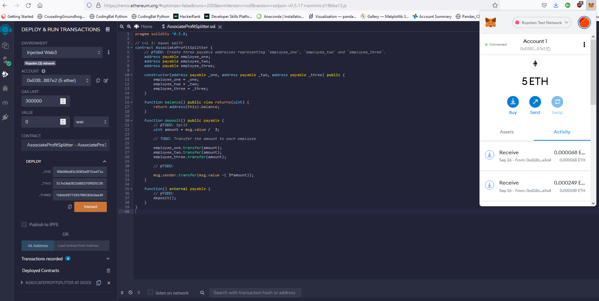
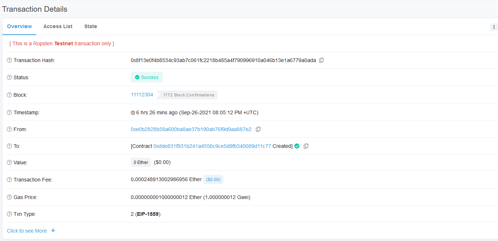
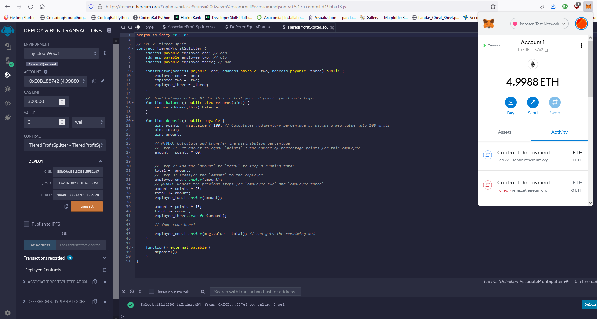
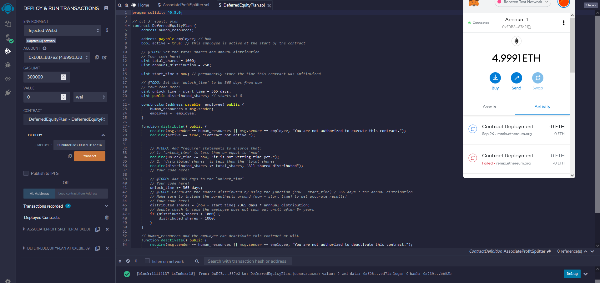
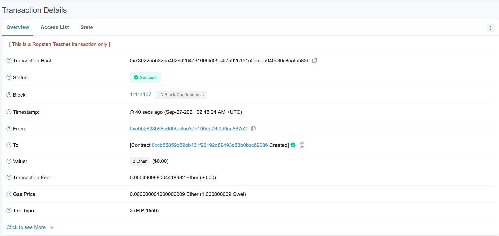

# Unit20Homework

Your new startup has created its own Ethereum-compatible blockchain to help connect financial institutions, and the team wants to build smart contracts to automate some company finances to make everyone's lives easier, increase transparency, and to make accounting and auditing practically automatic!
Fortunately, you've been learning how to program smart contracts with Solidity! What you will be doing this assignment is creating 3 ProfitSplitter contracts. These contracts will do several things:

Pay your Associate-level employees quickly and easily.

Distribute profits to different tiers of employees.

Distribute company shares for employees in a "deferred equity incentive plan" automatically.

Files

AssociateProfitSplitter.sol -- Level 1 starter code.

TieredProfitSplitter.sol -- Level 2 starter code.

DeferredEquityPlan.sol -- Level 3 starter code.

Instructions
This assignment has three levels of difficulty, with each contract increasing in complexity and capability. Although it is highly recommended you complete all three contracts, you are only required to solve one of the three contracts. Recommended to start with Level 1, then move forward as you complete the challenges. You can build all three with the skills you already have!

Level One is an AssociateProfitSplitter contract. This will accept Ether into the contract and divide the Ether evenly among the associate level employees. This will allow the Human Resources department to pay employees quickly and efficiently.

Level Two is a TieredProfitSplitter that will distribute different percentages of incoming Ether to employees at different tiers/levels. For example, the CEO gets paid 60%, CTO 25%, and Bob gets 15%.

Level Three is a DeferredEquityPlan that models traditional company stock plans. This contract will automatically manage 1000 shares with an annual distribution of 250 over 4 years for a single employee.

Starting your project
Navigate to the Remix IDE and create a new contract called AssociateProfitSplitter.sol using the starter code for level one above.
While developing and testing your contract, use the Ganache development chain, and point MetaMask to localhost:8545, or replace the port with what you have set in your workspace.

Level One: The AssociateProfitSplitter Contract
At the top of your contract, you will need to define the following public variables:

employee_one -- The address of the first employee. Make sure to set this to payable.

employee_two -- Another address payable that represents the second employee.

employee_three -- The third address payable that represents the third employee.

Create a constructor function that accepts:

address payable _one

address payable _two

address payable _three

Level Two: The TieredProfitSplitter Contract
In this contract, rather than splitting the profits between Associate-level employees, you will calculate rudimentary percentages for different tiers of employees (CEO, CTO, and Bob).
Using the starter code, within the deposit function, perform the following:

Calculate the number of points/units by dividing msg.value by 100.

This will allow us to multiply the points with a number representing a percentage. For example, points * 60 will output a number that is ~60% of the msg.value.

Level Three: The DeferredEquityPlan Contract
In this contract, we will be managing an employee's "deferred equity incentive plan" in which 1000 shares will be distributed over 4 years to the employee. We won't need to work with Ether in this contract, but we will be storing and setting amounts that represent the number of distributed shares the employee owns and enforcing the vetting periods automatically.

